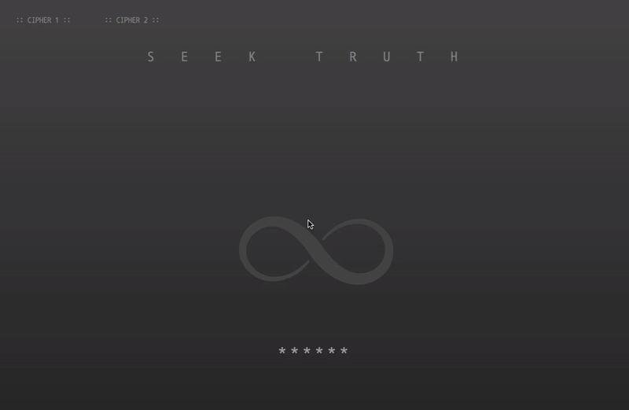

## Codeclan: Project 2 - Seek Truth

[See the live project](https://seek-truth.fraserkeir.com)

This app is the result of my week 9 group project, for CodeClan's professional software development course. The MEVN stack was used to create a puzzle based web app to be used as a marketing tool for local events.

Built in the vein of Cicada 3301, GCHQ's "Can you find it?", and events like Puzzled Pint; the project would rely on word of mouth and problem solving discussions on social media to drive traffic towards local events.

The landing page of the web app is built deliberately against UX principles to pose a challenge to the user. After solving the riddle and entering the password, the user is directed to an event details page. You can also access the admin page by entering the admin password.



### Project Overview

#### Stack

* Mongo
* Express
* Vue
* Node

#### Structure

The back-end of the project is a CRUD RESTful app using mongo, express, and node. It's also responsible for checking the riddle solutions/admin password before supplying the event data.

The front-end of the project consists of three views: landing page, user page, and admin page. Routing to these pages is password dependent from the landing page.

### Getting started

The project runs in two docker containers, with a third used to seed the database. You'll need [Docker](https://docs.docker.com/get-docker/) and [docker-compose](https://docs.docker.com/compose/install/) installed to create and start the Docker images:

```
docker-compose up
```
You can also use the ` -d ` tag to run the containers in detached mode. Once you are finished, stop the server using:

```
docker-compose down
```
Or `ctrl-c` to cancel within the non-detached mode terminal window.

### Functionality

#### Retrieving riddles

The mongo database has two collections `shindigs` (events) and `users`. The shindigs collection is not directly accessible from the landing page to prevent users from bypassing the riddle. A separate router was created to provide access to only the shindig's id and riddle question.

```javascript
    const riddlesRouter = express.Router();
```

```javascript
    riddlesRouter.get('/', (req, res) =>{
      shindigsCollection.find().toArray()
      .then(docs => docs.map(doc => {
        return {
          shindigId: doc._id,
          riddleQuestion: doc.riddleQuestion
        }
      }))
      .then(riddles => res.json(riddles))
      .catch(errorLog)
    })
```

#### Checking riddle answers

The riddle answers are also checked via the riddles router to prevent direct access. The provided answer is first checked against the hardcoded admin password, followed by the riddle answer. This will return either the code `admin` or a full shindig object as the response. If neither is matched, an error message is passed to the front end.

```javascript
riddlesRouter.post('/submit-answer', (req, res) => {
    const body = req.body;
    const userAnswer = body.userAnswer.toLowerCase();
    const shindigId = body.shindigId;
    
    shindigsCollection.findOne({
    _id: ObjectId(shindigId)
    })
    .then(shindig => {
        if (userAnswer === 'hunter2') {
        res.json('admin')
        }
        else if (userAnswer === shindig.riddleAnswer) {
        res.json(shindig)
        }
        else {
        res.json({ error: 'ERROR' })
        }
    })
    .catch(errorLog)
})
```

The front-end then uses this response to determine which page to show: admin, error, or user. The routing is achieved by switching boolean values used in v-if directives for the page views. Alternatively, if the user provides an incorrect answer the page is wiped, and a fake error page is shown.

```javascript
if (data === 'admin') {
    this.showUserPage = false
    this.showRiddlePage = false
    this.showAdminPage = true
}

else if (data.error) {
    const clearPage = document.getElementById('app');
    clearPage.innerHTML = "";
    const image = document.createElement('IMG')
    image.src = 'http://getwallpapers.com/wallpaper/full/0/3/5/40874.jpg';
    clearPage.appendChild(image);
}

else {
    this.selectedShindig = data
    this.showUserPage = true
    this.showRiddlePage = false
    this.showAdminPage = false
}
```

#### Document slide in

The 'seek truth' text and the sliding document are animated using css transitions. The animations are stored in css classes which are added and removed to the relevant objects in the DOM. 

```javascript
slideIn(){
    this.reduceLetterSpacing();
    const topSecretDocument =  document.getElementById('secret-document');
    topSecretDocument.classList.add('slideIn');
}
```

The slide out effect is achieved by removing the slideIn class.

```css
.slideIn {
  transform: translateY(-55vh);
  transition: transform 2s;
  opacity: 1;
}
```
### Suggestions for future work

* Add more puzzles with different formats, to keep the app interesting.
* Improve the aesthetic of the admin/user pages.
* Refactor the routing to use vue router to improve the behaviour of the website and tidy up the logic.
* Improve security: refactor the admin page into a separate app. This would further limit user access to the event data by allowing the removal of the api/shindigs route.